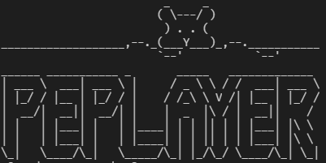

# ProyectoFinal 😎

## Descripción

PEPLAYER es un programa que permite realizar karaokes con distintas canciones que se encuentran separadas por genero, artistas, álbumes o simplemente se puede escoger manualmente la canción que deseas de la lista, adicionalmente el programa cuenta con una opción de reproducción aleatoria.

### Integrantes

- Pablo Loaiza Mejía

- Estefania López Varelas 

## Recursos

- [Markdown Cheatsheet](https://github.com/adam-p/markdown-here/wiki/Markdown-Cheatsheet)
- [Musica MIDI Gratis](http://www.musicamidigratis.com/)
- [Letras](https://www.letras.com/)

---

